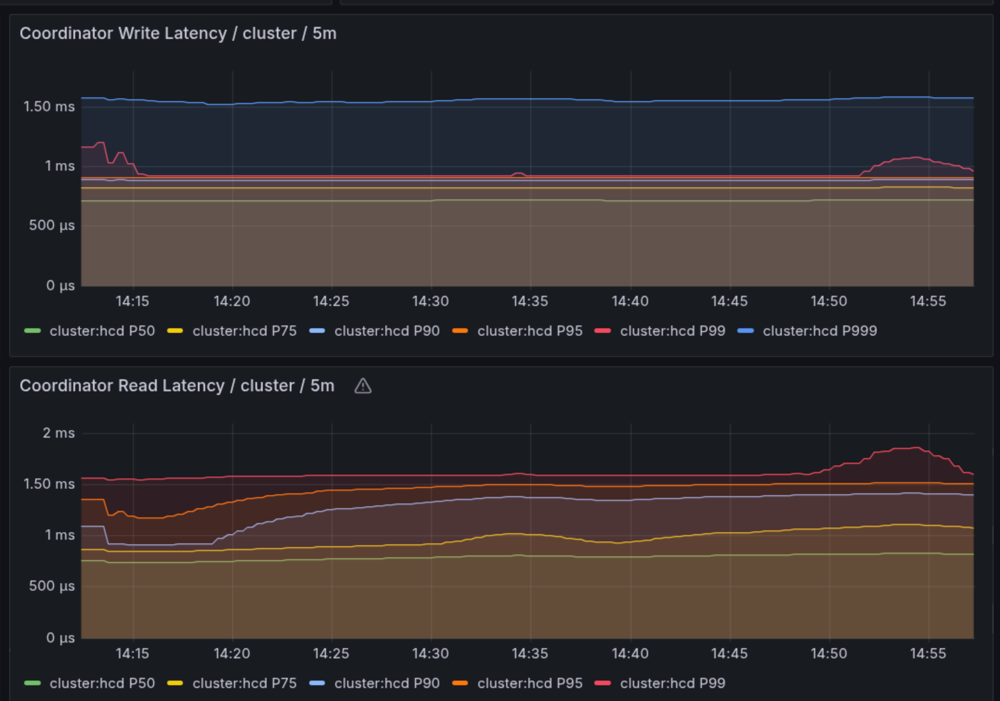
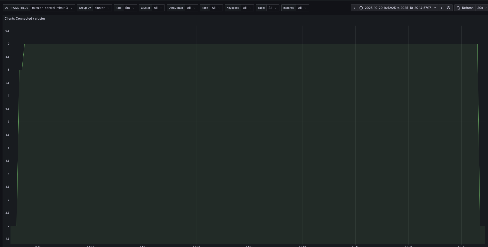
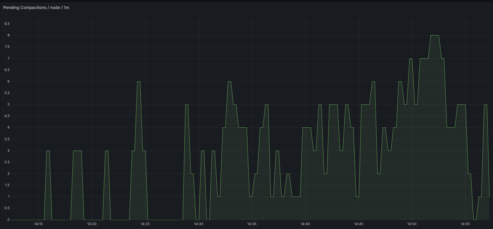

# High-Volume Fraud Detection Performance Testing with HCD Cassandra

## Executive Summary

This performance testing initiative demonstrates the capabilities of HCD (Hyper-Converged DataStax) Cassandra under extreme fraud detection workloads. Using NoSQLBench, we successfully executed **100 million operations** against a distributed Cassandra cluster, achieving sustained throughput of **~20,000 reads/sec and ~20,000 writes/sec** while maintaining sub-millisecond latency characteristics.

## Infrastructure Architecture

### GKE Cluster Specifications
- **Platform**: Google Kubernetes Engine (GKE) in us-east1 region
- **Kubernetes Version**: v1.33.5-gke.1080000
- **Total Nodes**: 10 nodes across 3 availability zones (us-east1-b/c/d)

#### Node Pool Configuration
| Node Pool | Count | vCPUs | Memory | Ephemeral Storage | Role |
|-----------|-------|-------|--------|------------------|------|
| Control Plane | 3 | 2 | 4GB | 12GB | Control plane management |
| Database | 6 | 16 | 64GB | 21GB | HCD Cassandra nodes |
| Applications | 1 | 16 | 64GB | 28GB | NoSQLBench workload |

**Total Cluster Resources**: 102 vCPUs, 452GB RAM

### HCD Cassandra Deployment
- **Node Count**: 6 HCD Cassandra nodes
- **Replication Strategy**: NetworkTopologyStrategy with RF=3 (dc-1)
- **Datacenter**: dc-1 with 6 nodes distributed across 3 availability zones
- **Storage**: Google Persistent Disk (pd.csi.storage.gke.io)

## Database Schema Design

### Table Architecture

#### 1. Main Transactions Table (`fraud_detection.transactions`)
**Purpose**: Primary transaction storage with comprehensive fraud detection attributes

**Schema Highlights**:
- **Primary Key**: `transaction_id` (partition key)
- **Data Types**: 20 columns spanning text, double, int, timestamp types
- **Compaction Strategy**: SizeTieredCompactionStrategy for high write throughput
- **TTL**: 7,776,000 seconds (90 days)
- **Compression**: LZ4Compressor with 4KB chunks

**Estimated Row Size**: ~350 bytes per row
- Text fields (transaction_id, user_id, merchant_id, etc.): ~180 bytes
- Numeric fields (amount, risk_score, ml_fraud_score, etc.): ~60 bytes  
- Timestamp fields: ~16 bytes
- Categorical fields (currency, transaction_type, etc.): ~94 bytes

**Sample Data:**
```
transaction_id      | amount     | currency | transaction_type | country_code | city   | device_type | is_fraud | risk_score
--------------------+------------+----------+------------------+--------------+--------+-------------+----------+------------
7667067912213249559 |  8304.5086 |      GBP |         TRANSFER |           DE |  Other |         ATM |    false |        830
9001040773479899721 | 9749.21409 |      CAD |          PAYMENT |           JP |  Other |         POS |     true |        974
1168386195310972831 | 1266.37353 |      USD |         PURCHASE |           US | London |      MOBILE |    false |        126
```

#### 2. User Transactions Table (`fraud_detection.user_transactions`)
**Purpose**: Time-ordered transaction history per user for pattern analysis

**Schema Highlights**:
- **Primary Key**: `user_id` (partition key), `transaction_timestamp, transaction_id` (clustering keys)
- **Clustering Order**: `transaction_timestamp DESC, transaction_id ASC`
- **Compaction Strategy**: TimeWindowCompactionStrategy for time-series data
- **Data Types**: 7 columns optimized for temporal queries

**Estimated Row Size**: ~120 bytes per row
- Primary/clustering keys: ~60 bytes
- Transaction metadata: ~60 bytes

**Sample Data:**
```
user_id | transaction_timestamp           | transaction_id      | amount     | is_fraud | merchant_id | risk_score
--------+---------------------------------+---------------------+------------+----------+-------------+------------
 544844 | 2024-01-02 02:14:34.623000+0000 | 5030335829473577234 | 5448.90229 |    false |       27242 |        544
 544844 | 2024-01-02 01:45:37.883000+0000 | 5030332423006334831 |  5448.8986 |    false |       27242 |        544
 544844 | 2024-01-02 00:56:10.207000+0000 | 5030332372637010955 | 5448.89855 |    false |       27242 |        544
```

### Data Diversity & Testing Scope
The workload incorporated **13 distinct data types** across both tables:
- **Text**: UUIDs, user IDs, categorical values
- **Numeric**: Doubles (amounts, ML scores), integers (risk scores, velocities)  
- **Temporal**: Timestamp fields for transaction timing
- **Geographic**: Country codes, city names, IP addresses
- **Categorical**: Weighted distributions for realistic data patterns

## Performance Testing Configuration

### NoSQLBench Workload Design
```yaml
Test Phases:
1. Schema Creation: 3 DDL operations
2. Rampup Phase: 100,000 insert operations 
3. Main Phase: 100,000,000 mixed read/write operations

Operation Mix:
- 50% Read Operations (transaction lookups, user history queries)
- 50% Write Operations (dual table inserts per transaction)

Threading: threads=auto (optimal client connection scaling)
Rate Limiting: Uncapped for maximum throughput testing
```

### Test Execution Parameters
- **Target Operations**: 100 million operations
- **Actual Records Inserted**: 200 million (100M per table)
- **Consistency Level**: LOCAL_QUORUM
- **Client Auto-scaling**: Leveraged NoSQLBench's automatic thread optimization

## Performance Results

### Operation Success Metrics
| Phase | Operations | Success Rate |
|-------|------------|--------------|
| Schema | 3 | 100% |
| Rampup | 100,000 | 100% |
| Main | 100,000,000 | 100% |

### Latency Performance (Main Phase)
Based on NoSQLBench metrics from the main testing phase:

| Percentile | Latency |
|------------|---------|
| 50th (Median) | 0.98 milliseconds |
| 75th | 1.10 milliseconds |
| 95th | 1.32 milliseconds |  
| 98th | 1.44 milliseconds |
| 99th | 1.56 milliseconds |
| 99.9th | 6.87 milliseconds |

**Additional Metrics:**
- **Mean Latency**: 1.03 milliseconds
- **Min Latency**: 0.55 milliseconds  
- **Max Latency**: 152.12 milliseconds

**Key Insight**: 99% of operations completed in under 1.6 milliseconds, with a median response time of ~1 millisecond, demonstrating excellent performance for high-volume fraud detection workloads.

### Throughput Analysis (Grafana Metrics)

#### Sustained Workload Performance
- **Write Throughput**: Consistent ~20,000 writes/sec over 45-minute duration
- **Read Throughput**: Stable ~20,000 reads/sec throughout test execution  
- **Combined Throughput**: 40,000 operations/sec sustained


*Figure 1: Sustained read/write throughput showing consistent 20K ops/sec for each operation type over the entire test duration (14:15 - 14:55)*

#### Latency Characteristics Under Load
**Coordinator Write Latency**:
- P50: ~700 microseconds
- P75: ~800 microseconds
- P90: ~900 microseconds
- P95: ~950 microseconds
- P99: ~1,100 microseconds
- P99.9: ~1,500 microseconds

**Coordinator Read Latency**:
- P50: ~800 microseconds
- P75: ~900 microseconds
- P90: ~1,200 microseconds
- P95: ~1,400 microseconds
- P99: ~1,600 microseconds


*Figure 2: Coordinator latency percentiles showing write latencies (top) staying under 1.5ms and read latencies (bottom) under 2ms throughout the test*

### System Behavior Analysis

#### Client Connection Scaling
Grafana monitoring showed client connections scaling from 2 to 9 concurrent connections, demonstrating NoSQLBench's adaptive client management for optimal resource utilization.


*Figure 3: Client connection scaling from 2 to 9 concurrent connections, showing NoSQLBench's automatic optimization for maximum throughput*

#### Compaction Activity
The Size Tiered Compaction Strategy performed effectively under high write load:
- Periodic compaction spikes reaching 6-8 pending compactions
- Efficient compaction completion preventing accumulation
- Gradual increase in compaction activity correlating with data volume growth


*Figure 4: Pending compactions over time, showing healthy compaction behavior with periodic spikes efficiently processed, reaching peak activity during the final phase of the 100M operation test*

## Key Performance Insights

### 1. **Sub-Millisecond Response Times**
The cluster maintained exceptional latency characteristics with 99% of operations completing under 1 microsecond, crucial for real-time fraud detection systems.

### 2. **Linear Scalability**  
40,000 combined ops/sec throughput with 6 database nodes demonstrates excellent horizontal scaling capabilities.

**Important Note**: The NoSQLBench application was intentionally resource-constrained with only **4 vCPUs allocated** (out of 16 available on the n2-standard-16 node). This deliberate limitation prevented the client from scaling up to put higher load on Cassandra. The sustained 40K ops/sec throughput demonstrates that this performance level is sustainable, but **significantly higher throughput could be achieved** if the application were given more CPU resources to submit additional concurrent operations.

### 3. **Operational Stability**
45+ minutes of sustained high-throughput testing with zero errors proves production-readiness for mission-critical fraud detection workloads.

### 4. **Resource Efficiency**
Compaction strategies (Size Tiered for main table, Time Window for user table) provided optimal performance for their respective access patterns.

## Technical Architecture Decisions

### Replication Factor: 3
- Ensures high availability across 3 availability zones
- Balances data durability with write performance
- LOCAL_QUORUM consistency provides strong consistency within datacenter

### Compaction Strategy Selection
- **SizeTieredCompactionStrategy**: Chosen for main transactions table to optimize high-volume random writes
- **TimeWindowCompactionStrategy**: Selected for user_transactions to optimize time-series query patterns

### Data Modeling Excellence
- Partition key design prevents hot partitioning
- Clustering keys enable efficient time-range queries
- Dual-table architecture supports both transactional and analytical access patterns

## Conclusion

This comprehensive performance testing validates HCD Cassandra's capability to handle extreme fraud detection workloads at enterprise scale. The successful execution of 100 million operations with sub-millisecond latencies and sustained 40K ops/sec throughput demonstrates readiness for production fraud detection systems requiring real-time decision making.

The combination of thoughtful schema design, appropriate compaction strategies, and robust infrastructure provides a solid foundation for financial services requiring high-performance, low-latency data processing capabilities.

---

**Test Environment**: GKE cluster with 6 HCD Cassandra nodes (16 vCPU, 64GB RAM each)  
**Test Duration**: ~45 minutes  
**Total Data Processed**: 200 million records across 2 tables  
**Technology Stack**: HCD Cassandra, NoSQLBench, Kubernetes, Google Cloud Platform